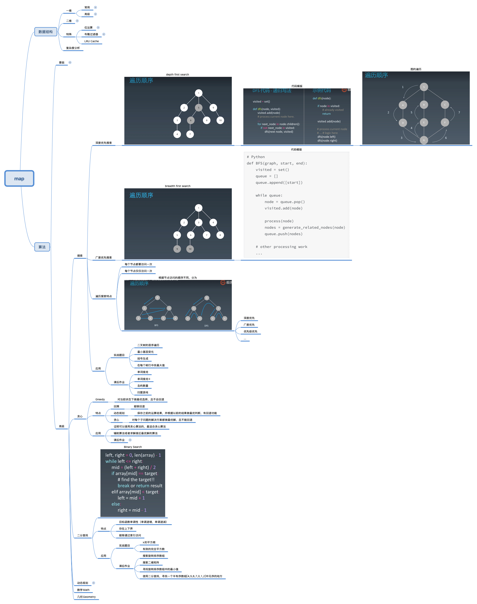

本周课程总结如下：

1. 深度优先搜索和广度优先搜索的特点与应用
  深度优先搜索和广度优先搜索，都是针对没有特点的数据结构，需要全部遍历找到目标值。
  深度优先的思想，以树为例，由根节点，不断向下遍历左子树直到底即叶子节点，然后再是右子树。
  广度优先的思想可以理解为水滴在不同层之间，由上之下的漫延。

2. 贪心算法的特点与应用
   一般来说，局部最优，不能实现全局最优。因此，在可证明贪心为最优解法时，例如硬币找零（一直硬币之间为倍数关系）一定会使用。但是通常，贪心算法是接近最优解，可以用于精确度不高的求解，或者作为辅助算法使用。

3. 二分查找的特点与应用
  二分查找需要满足以下条件：单调（递增或者递减），有边界，可索引访问。
